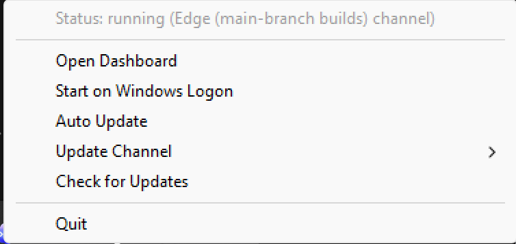

# CodexLB

**English** | [中文](README.zh-CN.md)

[](https://github.com/SpookySandwich/codex-lb-installer/releases)
[](https://github.com/SpookySandwich/codex-lb-installer/releases)

Windows installer for [Codex LB](https://github.com/Soju06/codex-lb).

<p align="center">
  
  
</p>

## Install

The installer is on the [Releases](https://github.com/SpookySandwich/codex-lb-installer/releases) page. Download `CodexLB_Installer.exe` and run it.

Setup adds Desktop and Start Menu shortcuts. You can remove it later from Windows Settings.

## Features

This repo is the installer and the updater. After setup, CodexLB runs from the system tray and opens the dashboard in the browser.

The tray can open the dashboard, start with Windows, and check for updates. Channels are Release, Beta, and Edge. Auto-update, if you turn it on, installs a newer build the next time CodexLB starts.

## Build

Building the installer needs Go, Inno Setup 6, Python with `uv` on PATH, Node, and Pillow. Clone [codex-lb](https://github.com/Soju06/codex-lb) into `codex-lb-src` at the repo root and build the frontend there first. Then install Pillow and `rsrc`, and run `bundle_build.py`. The finished installer is written to `dist/`.

```bash
git clone https://github.com/Soju06/codex-lb.git codex-lb-src
cd codex-lb-src/frontend && npm install && npm run build && cd ../..
pip install Pillow==12.3.0
go install github.com/akavel/rsrc@v0.10.2
python bundle_build.py
```

## License

MIT. The load balancer itself is [Soju06/codex-lb](https://github.com/Soju06/codex-lb).
