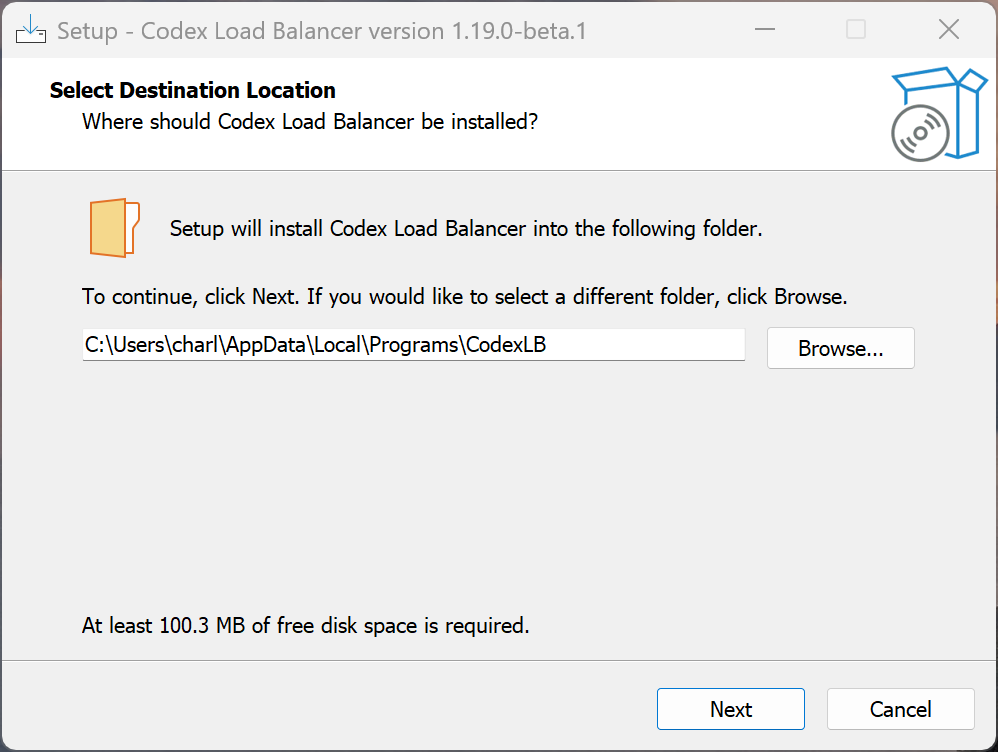

# Codex Load Balancer - Windows Installer & Launcher

[](https://github.com/Soju06/codex-lb)
[](https://www.python.org/)
[](https://go.dev/)
[](https://github.com/features/actions)

A complete, self-contained, and professional Windows installer package for the **Codex Load Balancer** project ([Soju06/codex-lb](https://github.com/Soju06/codex-lb)). 

This package bundles everything required—including the backend, frontend dashboard, and Python interpreter—into a single **zero-dependency setup wizard**. Install, launch, and uninstall Codex Load Balancer like a native Windows application.

---

## 📸 Installer Preview



---

## ✨ Features

*   🚀 **Zero Prerequisites**: Bundles a portable **Python 3.13.5** runtime environment and all dependency libraries. The target machine does not need Python, Node, Git, or Docker installed!
*   🤫 **Headless Executable**: When started, the program runs silently in the background. The command prompt window is completely hidden.
*   🌐 **Browser Pop-up**: On startup, the launcher automatically detects when the server is online and opens the frontend dashboard (`http://localhost:2455`) in the user's default browser.
*   🔒 **Single-Instance Mutex**: Utilizes a Windows Named Mutex (`Local\CodexLBLauncherMutex`). Double-clicking the shortcut again simply pops up the active browser dashboard and exits, preventing port clashes or duplicate server instances.
*   🛡️ **Low Privilege Install**: Installs directly to the user's local directory (`{localappdata}\Programs\CodexLB`). **Requires no Administrator privileges** to install or run.
*   🧹 **Clean Uninstall**: Fully integrated with Windows Add/Remove Programs. On uninstall, it queries the user if they want to clean up their database and configurations (`~/.codex-lb`) or preserve them.
*   🤖 **Automated GitHub Releases**: Configured with a scheduled GitHub Actions workflow that automatically detects new releases in the target repository, compiles the package, and publishes the fresh installer.

---

## 🛠️ How It Works

The installer aggregates three high-performance blocks:
1.  **Go Launcher (`launcher.exe`)**: A lightweight (< 1.5MB) Go-compiled executable running in Windows GUI mode (`-ldflags -H=windowsgui`) to suppress terminal windows. It manages the Python backend process, checks port readiness, and handles named mutexes.
2.  **Portable Python Bundle (`python/`)**: An optimized Python embeddable zip configured via `python313._pth` to route through a dedicated `site-packages` directory containing all backend dependencies and compiled Vite assets.
3.  **Inno Setup Compiler (`installer.iss`)**: Compresses and compiles all folders into a standard Windows installer wizard.

---

## 📥 Getting Started

1.  Download the latest `CodexLB_Installer.exe` from the **Releases** page of this repository.
2.  Double-click the installer and follow the setup wizard.
3.  Check the option to **Launch Codex Load Balancer** on finish (or use the Desktop/Start Menu shortcut).
4.  The server starts silently in the background, and your web browser will open the dashboard dashboard!

### Custom Port Configurations

By default, the server runs on port `2455`. If you need to run on a custom port, set the `PORT` environment variable before launching the application:
```powershell
$env:PORT="2460"
& "$env:LOCALAPPDATA\Programs\CodexLB\launcher.exe"
```
The launcher will automatically adapt, bind the server to port `2460`, and redirect your browser to the correct page.

---

## ⚙️ Local Build Instructions

If you want to compile and build the installer package locally:

### Prerequisites
*   Windows OS
*   [Go compiler](https://go.dev/doc/install) (Go 1.24+ recommended)
*   [Python](https://www.python.org/downloads/) (Python 3.12+ with `uv` package manager installed)
*   [Node.js / npm](https://nodejs.org/) (Node 22+ to build the frontend assets)
*   [Inno Setup 6](https://jrsoftware.org/isdl.php) (Make sure the compiler `ISCC.exe` is in `C:\Program Files (x86)\Inno Setup 6\`)

### Build Steps
1.  Clone this repository:
    ```bash
    git clone https://github.com/<your-username>/codex-lb-installer.git
    cd codex-lb-installer
    ```
2.  Clone the target repository:
    ```bash
    git clone https://github.com/Soju06/codex-lb.git codex-lb-src
    ```
3.  Build the React frontend assets:
    ```bash
    cd codex-lb-src/frontend
    npm install
    npm run build
    cd ../..
    ```
4.  Run the automated builder script:
    ```bash
    python bundle_build.py
    ```
5.  Find your compiled installer inside the `dist/` folder: `dist/CodexLB_Installer.exe`.

---

## 🤖 GitHub CI Release Automation

The repository contains a GitHub Actions workflow in `.github/workflows/build-release.yml`. It runs on a cron schedule to automate releases:
1.  Queries the GitHub API to check the latest release tag of [Soju06/codex-lb](https://github.com/Soju06/codex-lb).
2.  Compares it against our repository's current release tags.
3.  If a new version is detected, it clones the source tag, installs dependencies, compiles the launcher, builds the Inno Setup installer, and publishes the installer `.exe` as a release asset in our repository automatically!
